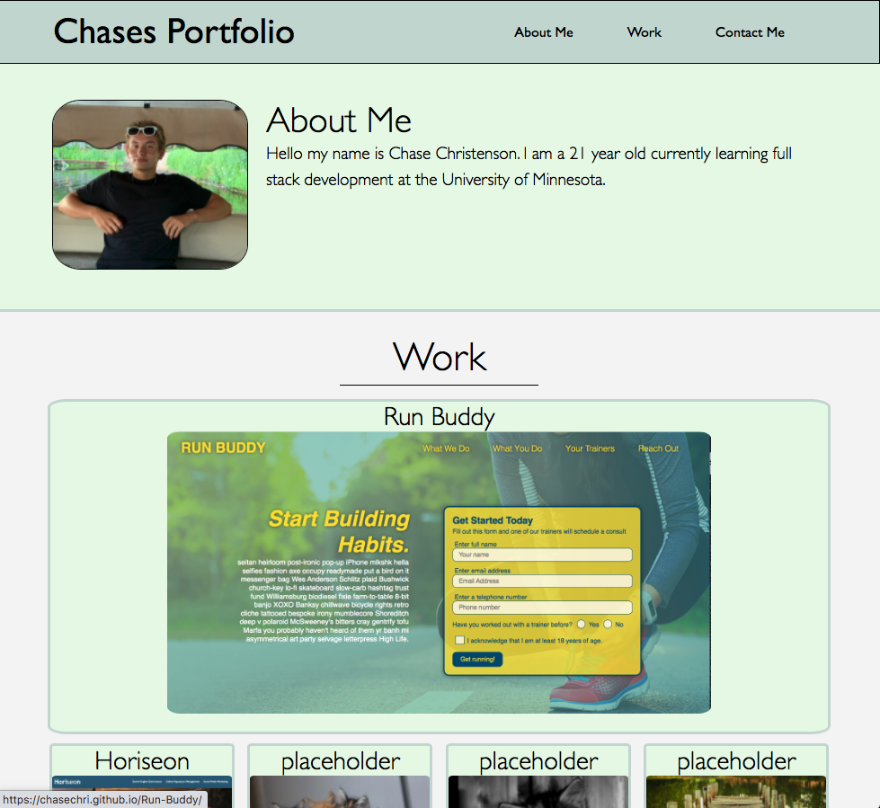

# portfolio-challenge-2-cc

## Overview

For this challenge I built a portfolio to display my work for potential employers.

## Tools used:

HTML, CSS.

## Link:

https://chasechri.github.io/portfolio-challenge-2-cc/

## Credits

I used https://flexbox.malven.co/ for flexbox advice.
I also used https://placekitten.com/ and https://picsum.photos/ for placeholder images.
